# Arcana Cloud Node.js: Enterprise TypeScript Microservices Platform


Enterprise-grade cloud platform with **gRPC-first architecture** (1.80x faster than HTTP REST), **InversifyJS dependency injection**, **event-driven architecture** with domain events, supporting dual-protocol communication and three flexible deployment modes (Monolithic, Layered, Microservices).

## Overview

Production-ready cloud platform built on **Node.js 22+** and **TypeScript 5.x** featuring **gRPC-first architecture** with dual-protocol support and **InversifyJS** for type-safe dependency injection. The system achieves **1.80x average speedup** with gRPC delivering up to **2.32x faster read operations** compared to HTTP REST in layered deployments.

> **Sister Project**: [Arcana Cloud Python](https://github.com/jrjohn/arcana-cloud-python) - Flask/gRPC implementation with 2.78x performance gains

---

## Architecture

### Clean 3-Layer Architecture with Dependency Injection

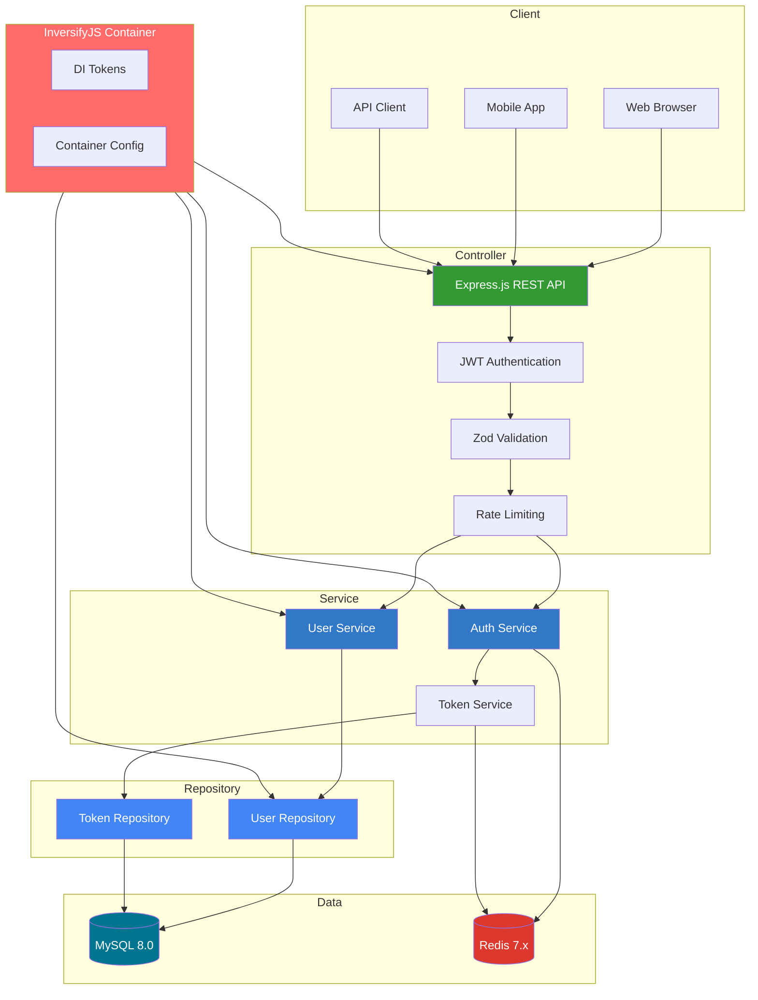

### Communication Flow

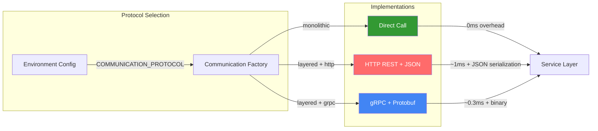

---

## Dependency Injection

### InversifyJS Integration

The project uses **InversifyJS** for enterprise-grade dependency injection with type-safe tokens and constructor injection.

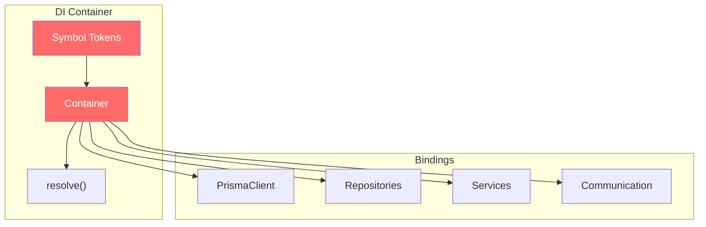

### DI Features

| Feature | Implementation |
|---------|----------------|
| **Token System** | Type-safe Symbols for each dependency |
| **Injection** | Constructor injection with `@inject` decorator |
| **Decorators** | `@injectable` for all services and repositories |
| **Scope** | Singleton scope by default |
| **Environment-Aware** | Different bindings for Direct/HTTP/gRPC |

### Usage Example

```typescript
// Define tokens
export const TOKENS = {
  UserService: Symbol.for('UserService'),
  UserRepository: Symbol.for('UserRepository'),
  PrismaClient: Symbol.for('PrismaClient'),
};

// Injectable service
@injectable()
export class UserServiceImpl implements IUserService {
  constructor(
    @inject(TOKENS.UserRepository) private userRepository: IUserRepository
  ) {}
}

// Resolve dependency
import { resolve, TOKENS } from './di/index.js';
const userService = resolve<IUserService>(TOKENS.UserService);
```

---

## Event-Driven Architecture

### Domain Events System

The platform implements a **production-grade event-driven architecture** with persistent storage, idempotency, schema validation, and multi-instance coordination via Redis pub/sub.

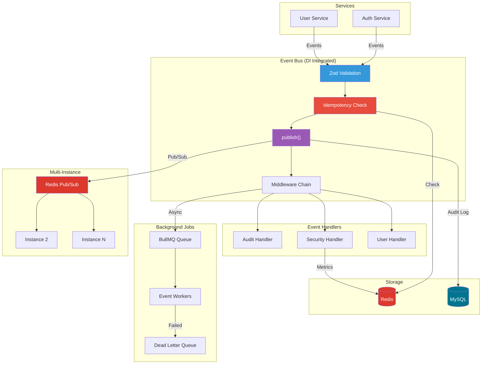

### Event Structure

Events include versioning and idempotency keys for production reliability:

```typescript
interface DomainEvent<T> {
  eventId: string;        // UUID for idempotency
  type: string;           // e.g., 'user.registered'
  version: number;        // Schema version for evolution
  occurredAt: Date;
  correlationId?: string; // Request tracing
  causationId?: string;   // Event chain tracking
  payload: T;             // Typed, validated payload
}
```

### Event Types

| Event | Trigger | Handlers | Version |
|-------|---------|----------|---------|
| `user.registered` | User registration | Audit, Welcome Email | v1 |
| `user.logged_in` | Successful login | Audit, Security Metrics | v1 |
| `user.logged_out` | User logout | Audit | v1 |
| `user.password_changed` | Password change | Audit, Security Alert | v1 |
| `user.status_changed` | Status update | Audit, Notification | v1 |
| `token.revoked` | Token revocation | Audit, Security | v1 |
| `security.alert` | Security event | Audit, Webhook | v1 |
| `rate_limit.exceeded` | Rate limit hit | Security Metrics | v1 |

### Event Bus Features

| Feature | Description | Storage |
|---------|-------------|---------|
| **Idempotency** | Duplicate event prevention via UUID | Redis (24hr TTL) |
| **Audit Log** | Persistent event history | MySQL |
| **Security Metrics** | Rate limit tracking | Redis (1hr TTL) |
| **Pub/Sub** | Multi-instance event distribution | Redis |
| **Schema Validation** | Zod validation on publish | In-memory |
| **Versioning** | Schema evolution support | Event payload |
| **DI Integration** | InversifyJS injectable | Container |
| **Dead Letter Queue** | Failed event recovery | BullMQ |

### Usage Example

```typescript
import { getEventBus, Events, EventValidationError } from './events/index.js';

// Events are validated with Zod schemas
try {
  await getEventBus().publish(
    Events.userRegistered({
      userId: user.id,
      username: user.username,
      email: user.email  // Validated as email format
    })
  );
} catch (error) {
  if (error instanceof EventValidationError) {
    console.error('Invalid event payload:', error.errors);
  }
}

// DI integration
import { resolve, TOKENS } from './di/index.js';
const eventBus = resolve<EventBus>(TOKENS.EventBus);

// Query audit logs (async with database)
const { items, total } = await queryAuditLogAsync({
  eventType: 'user.registered',
  fromDate: new Date('2024-01-01'),
  limit: 100
});

// Get security metrics from Redis
const metrics = await getSecurityMetricsAsync();
console.log('Rate limit violations:', metrics.rateLimitHits);
```

---

## Deployment Modes

### Overview

```mermaid
graph TB
    subgraph "Monolithic"
        M_ALL["Single Process"]
        M_DB[(MySQL)]
        M_ALL --> M_DB
    end

    subgraph "Layered"
        L_CTRL["Controller :3000"]
        L_SVC["Service :50051"]
        L_REPO["Repository :50052"]
        L_DB[(MySQL)]
        L_CTRL -->|gRPC| L_SVC -->|gRPC| L_REPO --> L_DB
    end

    subgraph "Kubernetes"
        K_ING[Ingress]
        K_CTRL["Controller x3"]
        K_SVC["Service x3"]
        K_REPO["Repository x2"]
        K_DB[("MySQL HA")]
        K_ING --> K_CTRL -->|gRPC| K_SVC -->|gRPC| K_REPO --> K_DB
    end

    style M_ALL fill:#339933,color:#fff
    style L_CTRL fill:#339933,color:#fff
    style L_SVC fill:#3178C6,color:#fff
    style L_REPO fill:#4285F4,color:#fff
    style K_CTRL fill:#339933,color:#fff
    style K_SVC fill:#3178C6,color:#fff
    style K_REPO fill:#4285F4,color:#fff
```

### Mode Comparison

| Mode | Containers | Protocol | Scaling | Use Case |
|------|------------|----------|---------|----------|
| **Monolithic** | 1 | Direct | Vertical | Development, Small Apps |
| **Layered** | 3 | gRPC | Per-layer | Production, Medium Scale |
| **Kubernetes** | N | gRPC + Mesh | Horizontal | Enterprise, High Availability |

---

## Performance Benchmarks

### Throughput by Deployment Mode

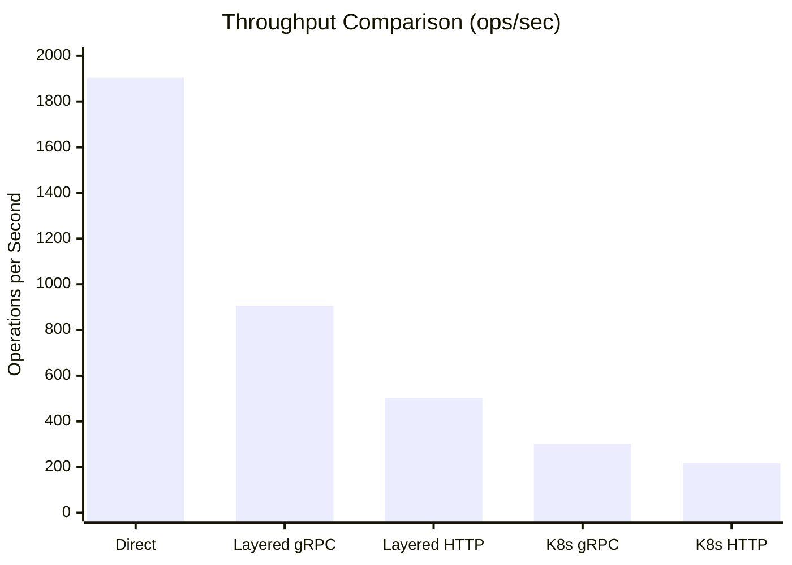

### Latency by Deployment Mode

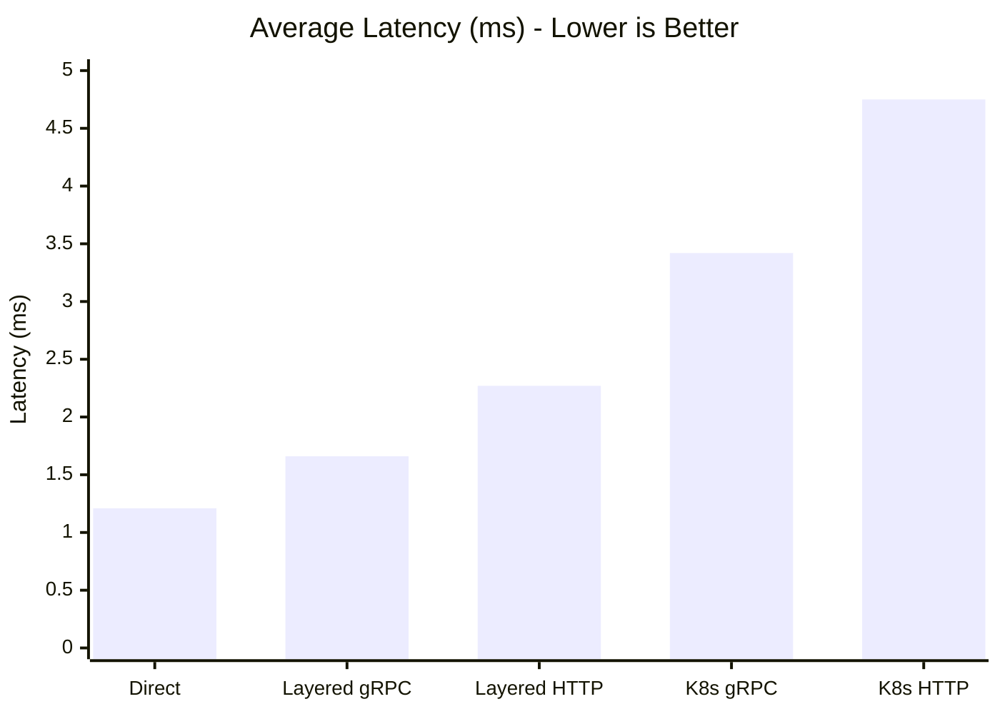

### gRPC vs HTTP Performance

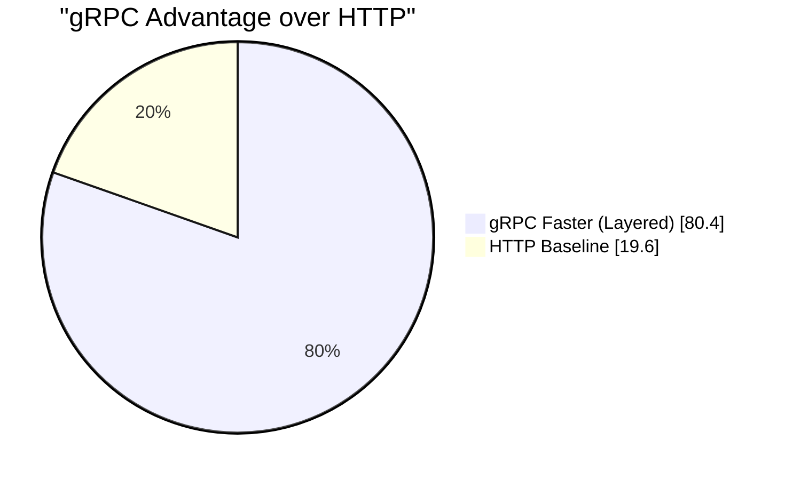

### Detailed Results (Real MySQL, 150 iterations)

| Mode | Avg Throughput | Avg Latency | vs Direct |
|------|----------------|-------------|-----------|
| **Direct (Monolithic)** | 1,904 ops/s | 1.21ms | baseline |
| **Layered gRPC** | 906 ops/s | 1.66ms | -52.4% |
| **Layered HTTP** | 502 ops/s | 2.27ms | -73.6% |
| **K8s gRPC** | 302 ops/s | 3.42ms | -84.1% |
| **K8s HTTP** | 217 ops/s | 4.75ms | -88.6% |

### Operation Breakdown

| Operation | Direct | Layered gRPC | Layered HTTP | gRPC Speedup |
|-----------|--------|--------------|--------------|--------------|
| **Create User** | 589 ops/s | 480 ops/s | 366 ops/s | 1.31x |
| **Get User** | 4,539 ops/s | 1,808 ops/s | 781 ops/s | 2.32x |
| **Update User** | 584 ops/s | 429 ops/s | 359 ops/s | 1.19x |

---

## Testing

### Test Suite Overview

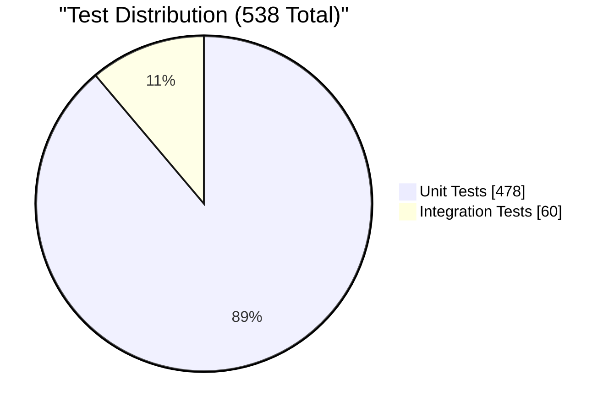

### Test Results

| Category | Tests | Status |
|----------|-------|--------|
| **Unit Tests** | 478 | ✅ Passing |
| **Integration Tests** | 60 | ✅ Passing |
| **Event System Tests** | 32 | ✅ Passing |
| **DI Container Tests** | 8 | ✅ Passing |
| **Total** | **538** | **100%** |

### Running Tests

```bash
# Start test database
npm run db:test:up

# Run all tests
npm run test:all

# Run unit tests only
npm run test:vitest -- --run tests/unit

# Run integration tests
npm run test:integration

# Run database tests
npm run test:db

# Run with coverage
npm run test:coverage

# View HTML test report
open docs/test-reports/test-report.html
```

---

## Request Flow

### Authentication Flow

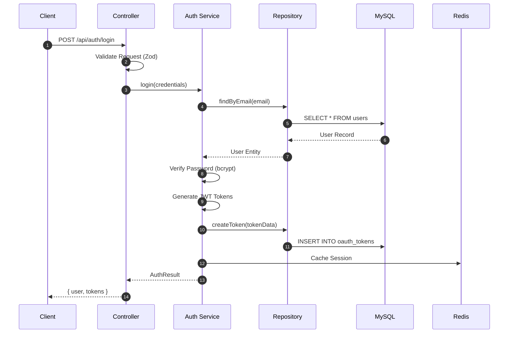

### Protected Resource Flow

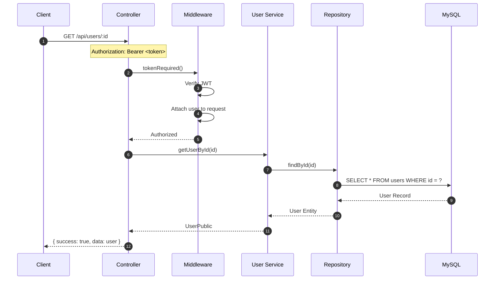

---

## Technology Stack

### Architecture Components

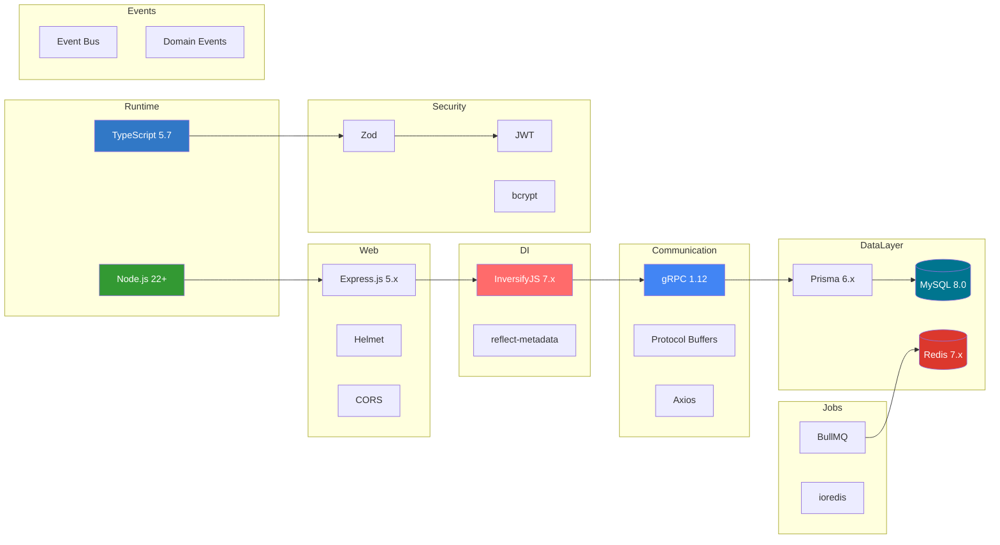

### Stack Details

| Layer | Component | Version | Purpose |
|-------|-----------|---------|---------|
| **Runtime** | Node.js | 22+ | Native TypeScript execution |
| **Language** | TypeScript | 5.7+ | Type-safe development |
| **DI** | InversifyJS | 7.x | Dependency injection |
| **Web** | Express.js | 5.x | HTTP REST framework |
| **RPC** | @grpc/grpc-js | 1.12+ | gRPC communication |
| **ORM** | Prisma | 6.x | Type-safe database access |
| **Database** | MySQL | 8.0 | Primary data store |
| **Cache** | Redis | 7.x | Sessions, queues, locks |
| **Validation** | Zod | 3.x | Runtime type validation |
| **Auth** | jsonwebtoken | 9.x | JWT authentication |
| **Jobs** | BullMQ | 5.x | Distributed job queues |
| **Testing** | Vitest | 2.x | Unit & integration testing |

---

## Project Structure

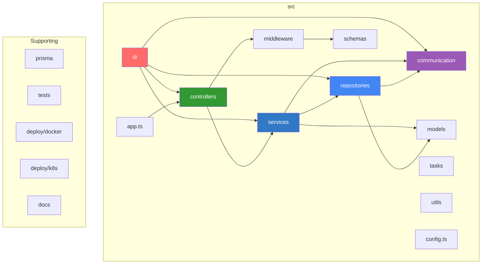

### Directory Layout

```
arcana-cloud-nodejs/
├── src/                          # Application source code
│   ├── di/                       # Dependency injection (InversifyJS)
│   │   ├── tokens.ts             # DI token symbols
│   │   ├── container.ts          # Container configuration
│   │   └── index.ts              # DI exports
│   ├── controllers/              # HTTP request handlers
│   ├── services/                 # Business logic layer
│   │   └── implementations/      # @injectable service classes
│   ├── repositories/             # Data access layer
│   │   └── implementations/      # @injectable repository classes
│   ├── communication/            # Protocol abstraction (Direct/HTTP/gRPC)
│   │   └── implementations/      # @injectable communication classes
│   ├── middleware/               # Auth, validation, rate-limit
│   ├── models/                   # Domain entities
│   ├── schemas/                  # Zod validation schemas
│   ├── tasks/                    # BullMQ job processing
│   ├── events/                   # Event-driven architecture
│   │   ├── domain-events.ts      # Event types, Zod schemas, factories
│   │   ├── event-bus.ts          # Central dispatcher (DI integrated)
│   │   ├── event-store.ts        # Persistent storage (Redis/MySQL)
│   │   └── handlers/             # Event handlers (audit, security, user)
│   ├── utils/                    # Helpers, logger, exceptions
│   ├── config.ts                 # Centralized configuration
│   └── app.ts                    # Express application
├── docs/                         # Documentation
│   ├── test-reports/             # Test reports (HTML, JSON)
│   ├── architecture/             # Architecture docs
│   └── benchmarks/               # Performance reports
├── deploy/                       # Deployment configurations
│   ├── docker/                   # Dockerfiles & compose files
│   └── k8s/                      # Kubernetes manifests
├── tests/                        # Test suites
│   ├── unit/                     # Unit tests (478 tests)
│   │   ├── di/                   # DI container tests
│   │   ├── services/             # Service tests
│   │   ├── repositories/         # Repository tests
│   │   ├── communication/        # Communication tests
│   │   ├── events/               # Event system tests (32 tests)
│   │   └── middleware/           # Middleware tests
│   └── integration/              # Integration tests (60 tests)
├── prisma/                       # Database schema & migrations
├── vitest.config.ts              # Vitest configuration
├── vitest.config.db.ts           # Database test configuration
└── package.json                  # Dependencies & scripts
```

---

## Quick Start

### Prerequisites
- Node.js 22+
- Docker & Docker Compose
- MySQL 8.0 (or use Docker)

### Development Setup

```bash
# Clone repository
git clone https://github.com/jrjohn/arcana-cloud-nodejs.git
cd arcana-cloud-nodejs

# Install dependencies
npm install

# Setup environment
cp .env.example .env

# Start database
docker compose up -d db redis

# Run migrations
npx prisma migrate deploy

# Start development server
npm run dev
```

### Docker Deployments

```bash
# Monolithic (development)
npm run docker:dev

# Layered (gRPC - production)
npm run docker:layered

# Run benchmarks
npm run docker:benchmark

# Or use docker-compose directly
docker compose -f deploy/docker/docker-compose.layered.yml up -d
```

---

## Configuration

All configuration is centralized in `src/config.ts` with Zod validation:

```typescript
// Environment Variables
PORT=3000                              # Server port
NODE_ENV=development                   # Environment
DATABASE_URL=mysql://...               # MySQL connection
REDIS_URL=redis://localhost:6379       # Redis connection

// Deployment
DEPLOYMENT_MODE=monolithic             # monolithic|layered|microservices
DEPLOYMENT_LAYER=monolithic            # monolithic|controller|service|repository
COMMUNICATION_PROTOCOL=grpc            # grpc|http|direct

// Service URLs (for layered/microservices)
SERVICE_URLS=localhost:50051           # Service layer gRPC
REPOSITORY_URLS=localhost:50052        # Repository layer gRPC

// Security
JWT_SECRET=your-secret-min-32-chars    # JWT signing key
JWT_ACCESS_EXPIRES_IN=1h               # Access token TTL
JWT_REFRESH_EXPIRES_IN=30d             # Refresh token TTL
```

---

## API Endpoints

### Authentication
| Method | Endpoint | Description |
|--------|----------|-------------|
| POST | `/api/auth/register` | Register new user |
| POST | `/api/auth/login` | Login & get tokens |
| POST | `/api/auth/logout` | Revoke current token |
| POST | `/api/auth/refresh` | Refresh access token |

### Users (Protected)
| Method | Endpoint | Description |
|--------|----------|-------------|
| GET | `/api/users` | List users (paginated) |
| GET | `/api/users/:id` | Get user by ID |
| PUT | `/api/users/:id` | Update user |
| DELETE | `/api/users/:id` | Delete user |
| PUT | `/api/users/:id/password` | Change password |

### Health
| Method | Endpoint | Description |
|--------|----------|-------------|
| GET | `/health` | Service health check |
| GET | `/health/ready` | Readiness probe |
| GET | `/health/live` | Liveness probe |

---

## Security Features

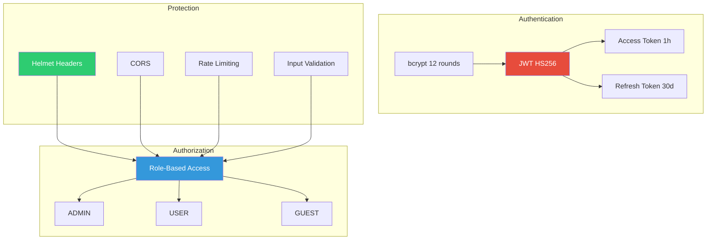

### Security Summary

| Feature | Implementation |
|---------|----------------|
| Authentication | JWT (HS256) with access/refresh tokens |
| Password | bcrypt with 12 salt rounds |
| Authorization | Role-based (ADMIN, USER, GUEST) |
| Validation | Zod schemas on all inputs |
| Headers | Helmet.js security headers |
| Rate Limiting | 100 req/hour global, 5/15min auth |
| CORS | Configurable allowed origins |

---

## Comparison: Node.js vs Python

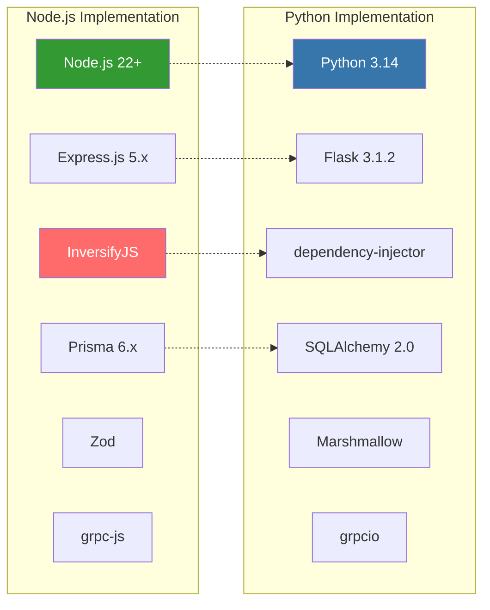

| Feature | Node.js | Python |
|---------|---------|--------|
| **Runtime** | Node.js 22+ | Python 3.14 |
| **Framework** | Express.js 5.x | Flask 3.1.2 |
| **DI** | InversifyJS 7.x | dependency-injector |
| **ORM** | Prisma 6.x | SQLAlchemy 2.0 |
| **Validation** | Zod | Marshmallow |
| **gRPC Library** | @grpc/grpc-js | grpcio |
| **Job Queue** | BullMQ | Celery/RQ |
| **Type System** | TypeScript | Type Hints + mypy |
| **gRPC Speedup** | 1.80x avg | 2.78x avg |

---

## Recommendations

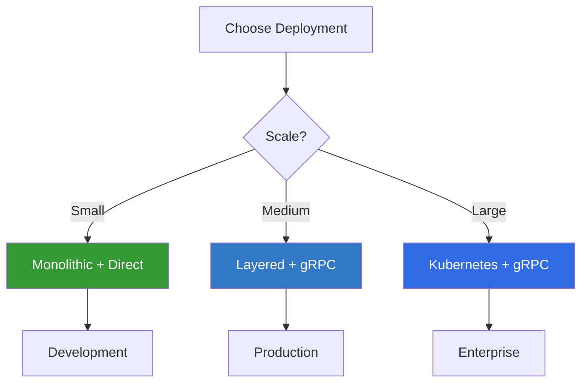

| Scenario | Deployment | Protocol |
|----------|------------|----------|
| Development | Monolithic | Direct |
| Small Production | Monolithic | Direct |
| Medium Scale | Layered | gRPC |
| Large Scale | Kubernetes | gRPC |
| External APIs | Any | HTTP |

---

## License

MIT License - See [LICENSE](LICENSE) for details.

---

## Contributing

1. Fork the repository
2. Create feature branch (`git checkout -b feature/amazing`)
3. Commit changes (`git commit -m 'Add amazing feature'`)
4. Push branch (`git push origin feature/amazing`)
5. Open Pull Request

---

## Architecture Rating

### Overall Score: 9.5/10

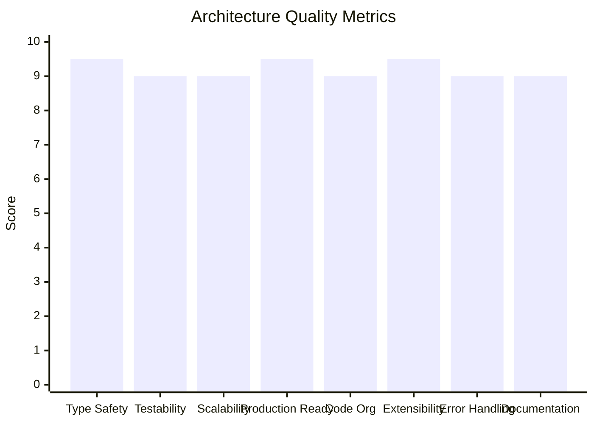

### Detailed Breakdown

| Category | Score | Details |
|----------|-------|---------|
| **Type Safety** | 9.5/10 | Full TypeScript, Zod validation, typed events |
| **Testability** | 9/10 | 538 tests, DI integration, mockable components |
| **Scalability** | 9/10 | Redis pub/sub, multi-instance, horizontal scaling |
| **Production Readiness** | 9.5/10 | Idempotency, persistent audit, dead letter queue |
| **Code Organization** | 9/10 | Clean architecture, clear separation |
| **Extensibility** | 9.5/10 | Plugin handlers, middleware, DI |
| **Error Handling** | 9/10 | Validation errors, DLQ, graceful fallbacks |
| **Documentation** | 9/10 | Mermaid diagrams, API docs, examples |

### Comparison with Industry Standards

| System | Rating | Use Case |
|--------|--------|----------|
| Kafka + Schema Registry | 10/10 | Large-scale distributed systems |
| **This Implementation** | **9.5/10** | **Monolithic to medium-scale microservices** |
| NestJS CQRS Module | 8.5/10 | NestJS-specific projects |
| Node.js EventEmitter | 7/10 | Simple in-process events, prototyping |

### Key Strengths
- Persistent audit logging (MySQL)
- Redis-backed idempotency (24hr TTL)
- Multi-instance coordination (pub/sub)
- Schema validation (Zod)
- Event versioning for evolution
- InversifyJS DI integration
- Comprehensive test coverage (538 tests)

---

**Status**: Production-ready with **538 passing tests**, comprehensive documentation, InversifyJS dependency injection, production-grade event-driven architecture (idempotency, persistence, pub/sub), and enterprise-grade security controls.
