# Arcana Cloud Node.js: Enterprise TypeScript Microservices Platform


Enterprise-grade cloud platform with **gRPC-first architecture** (1.80x faster than HTTP REST), supporting dual-protocol communication and three flexible deployment modes (Monolithic, Layered, Microservices).

## Overview

Production-ready cloud platform built on **Node.js 22+** and **TypeScript 5.x** featuring **gRPC-first architecture** with dual-protocol support. The system achieves **1.80x average speedup** with gRPC delivering up to **2.32x faster read operations** compared to HTTP REST in layered deployments.

> **Sister Project**: [Arcana Cloud Python](https://github.com/jrjohn/arcana-cloud-python) - Flask/gRPC implementation with 2.78x performance gains

---

## Architecture

### Clean 3-Layer Architecture

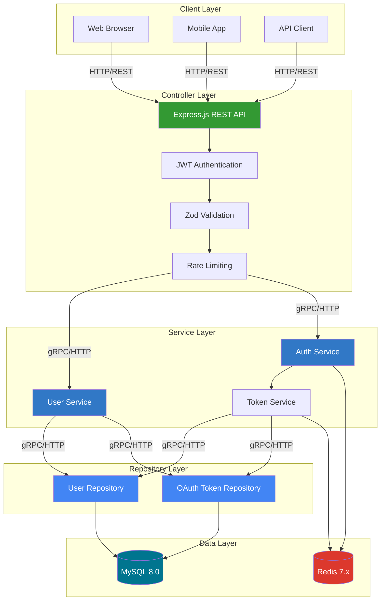

### Communication Flow

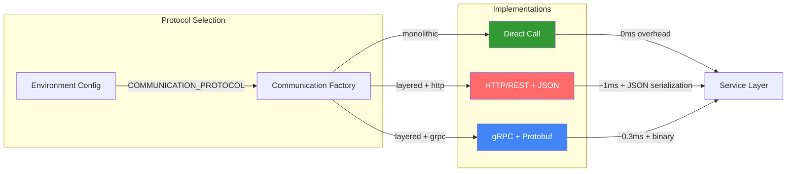

---

## Deployment Modes

### Overview

```mermaid
graph TB
    subgraph "Monolithic"
        M_ALL[Single Process<br/>Controller + Service + Repository]
        M_DB[(MySQL)]
        M_ALL --> M_DB
    end

    subgraph "Layered"
        L_CTRL[Controller<br/>:3000]
        L_SVC[Service<br/>:50051]
        L_REPO[Repository<br/>:50052]
        L_DB[(MySQL)]
        L_CTRL -->|gRPC| L_SVC -->|gRPC| L_REPO --> L_DB
    end

    subgraph "Kubernetes"
        K_ING[Ingress]
        K_CTRL[Controller Pods<br/>x3]
        K_SVC[Service Pods<br/>x3]
        K_REPO[Repository Pods<br/>x2]
        K_DB[(MySQL<br/>Primary/Replica)]
        K_ING --> K_CTRL -->|gRPC + Service Mesh| K_SVC -->|gRPC| K_REPO --> K_DB
    end

    style M_ALL fill:#339933,color:#fff
    style L_CTRL fill:#339933,color:#fff
    style L_SVC fill:#3178C6,color:#fff
    style L_REPO fill:#4285F4,color:#fff
    style K_CTRL fill:#339933,color:#fff
    style K_SVC fill:#3178C6,color:#fff
    style K_REPO fill:#4285F4,color:#fff
```

### Mode Comparison

| Mode | Containers | Protocol | Scaling | Use Case |
|------|------------|----------|---------|----------|
| **Monolithic** | 1 | Direct | Vertical | Development, Small Apps |
| **Layered** | 3 | gRPC | Per-layer | Production, Medium Scale |
| **Kubernetes** | N | gRPC + Mesh | Horizontal | Enterprise, High Availability |

---

## Performance Benchmarks

### Throughput by Deployment Mode

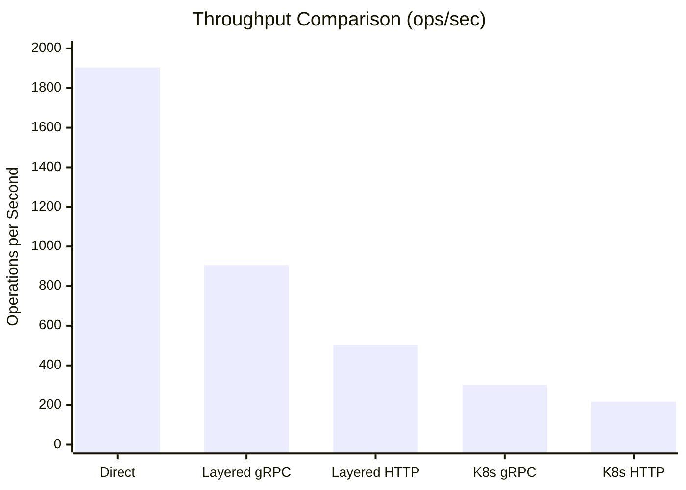

### Latency by Deployment Mode

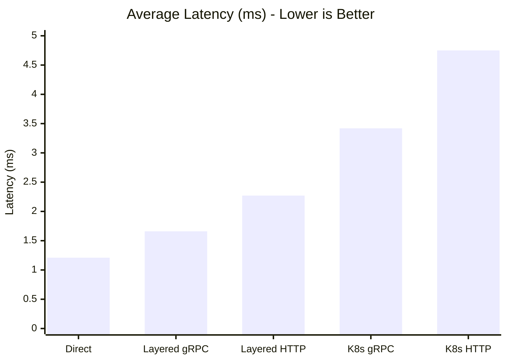

### gRPC vs HTTP Performance

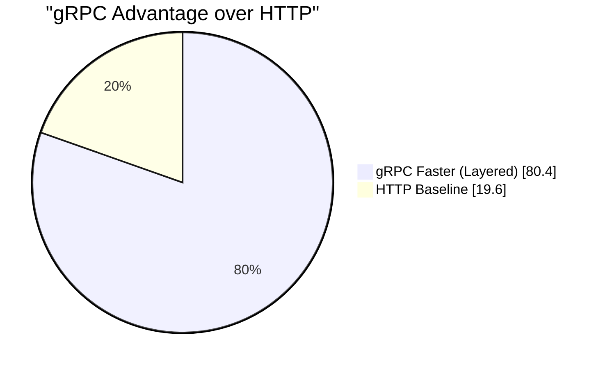

### Detailed Results (Real MySQL, 150 iterations)

| Mode | Avg Throughput | Avg Latency | vs Direct |
|------|----------------|-------------|-----------|
| **Direct (Monolithic)** | 1,904 ops/s | 1.21ms | baseline |
| **Layered gRPC** | 906 ops/s | 1.66ms | -52.4% |
| **Layered HTTP** | 502 ops/s | 2.27ms | -73.6% |
| **K8s gRPC** | 302 ops/s | 3.42ms | -84.1% |
| **K8s HTTP** | 217 ops/s | 4.75ms | -88.6% |

### Operation Breakdown

| Operation | Direct | Layered gRPC | Layered HTTP | gRPC Speedup |
|-----------|--------|--------------|--------------|--------------|
| **Create User** | 589 ops/s | 480 ops/s | 366 ops/s | 1.31x |
| **Get User** | 4,539 ops/s | 1,808 ops/s | 781 ops/s | 2.32x |
| **Update User** | 584 ops/s | 429 ops/s | 359 ops/s | 1.19x |

---

## Request Flow

### Authentication Flow

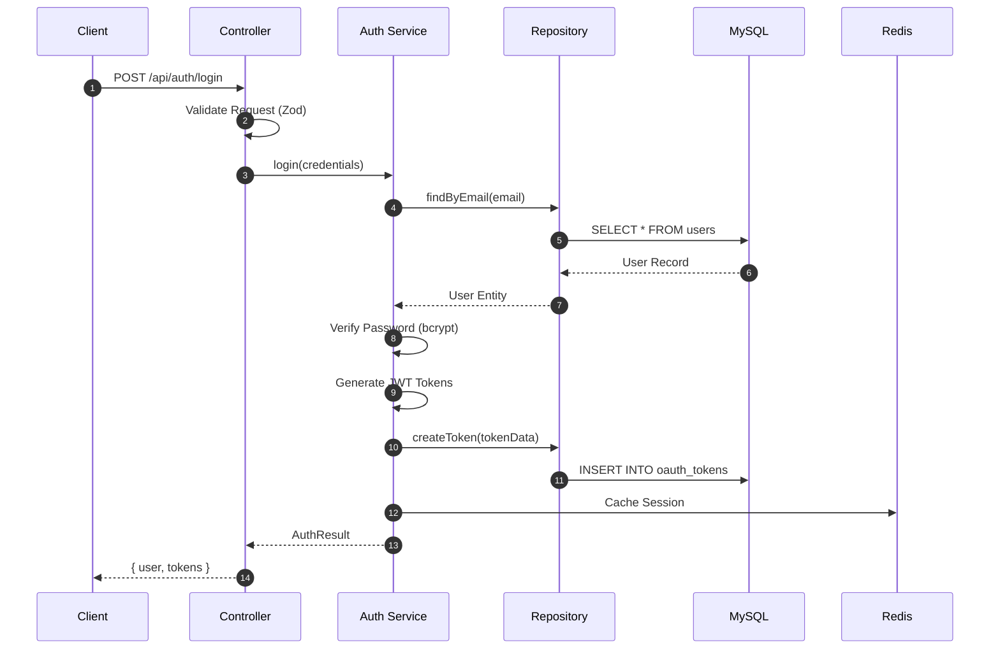

### Protected Resource Flow

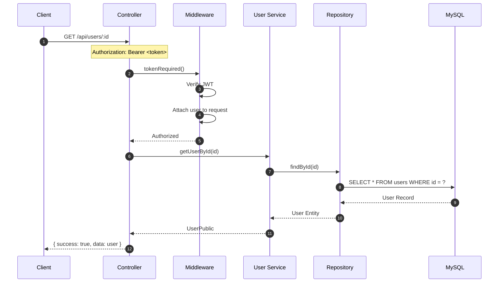

---

## Technology Stack

### Architecture Components

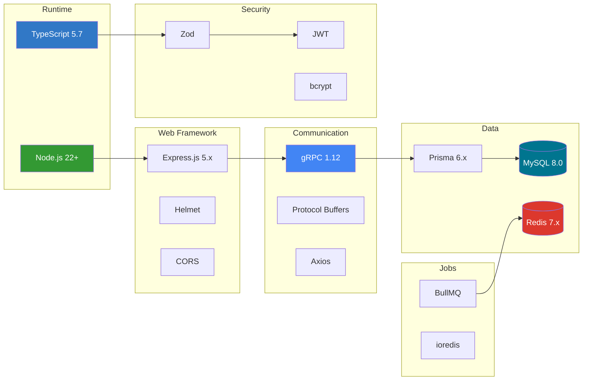

### Stack Details

| Layer | Component | Version | Purpose |
|-------|-----------|---------|---------|
| **Runtime** | Node.js | 22+ | Native TypeScript execution |
| **Language** | TypeScript | 5.7+ | Type-safe development |
| **Web** | Express.js | 5.x | HTTP REST framework |
| **RPC** | @grpc/grpc-js | 1.12+ | gRPC communication |
| **ORM** | Prisma | 6.x | Type-safe database access |
| **Database** | MySQL | 8.0 | Primary data store |
| **Cache** | Redis | 7.x | Sessions, queues, locks |
| **Validation** | Zod | 3.x | Runtime type validation |
| **Auth** | jsonwebtoken | 9.x | JWT authentication |
| **Jobs** | BullMQ | 5.x | Distributed job queues |

---

## Project Structure

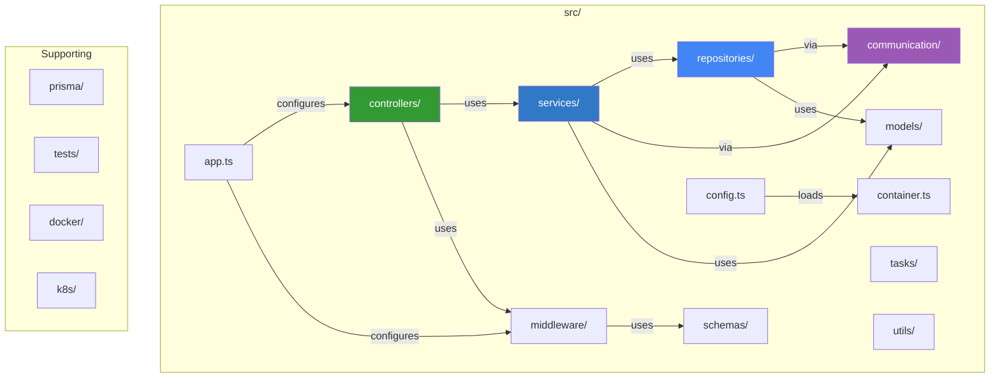

### Directory Layout

```
arcana-cloud-nodejs/
├── src/
│   ├── controllers/          # HTTP request handlers
│   ├── services/
│   │   ├── interfaces/       # Service contracts
│   │   └── implementations/  # Business logic
│   ├── repositories/
│   │   ├── interfaces/       # Repository contracts
│   │   └── implementations/  # Prisma data access
│   ├── communication/
│   │   ├── interfaces.ts     # Protocol abstractions
│   │   ├── factory.ts        # Protocol factory
│   │   └── implementations/  # Direct/HTTP/gRPC
│   ├── middleware/           # Auth, validation, rate-limit
│   ├── models/               # Domain entities
│   ├── schemas/              # Zod validation schemas
│   ├── tasks/                # BullMQ job processing
│   ├── utils/                # Helpers, logger, exceptions
│   ├── config.ts             # Centralized configuration
│   ├── container.ts          # Dependency injection
│   └── app.ts                # Express application
├── prisma/
│   └── schema.prisma         # Database schema
├── tests/
│   ├── unit/                 # Unit tests
│   ├── database/             # Integration tests
│   └── benchmark/            # Performance tests
├── docker/                   # Dockerfiles per layer
├── k8s/                      # Kubernetes manifests
└── docker-compose*.yml       # Compose configurations
```

---

## Quick Start

### Prerequisites
- Node.js 22+
- Docker & Docker Compose
- MySQL 8.0 (or use Docker)

### Development Setup

```bash
# Clone repository
git clone https://github.com/jrjohn/arcana-cloud-nodejs.git
cd arcana-cloud-nodejs

# Install dependencies
npm install

# Setup environment
cp .env.example .env

# Start database
docker compose up -d db redis

# Run migrations
npx prisma migrate deploy

# Start development server
npm run dev
```

### Docker Deployments

```bash
# Monolithic
docker compose up -d

# Layered (gRPC)
docker compose -f docker-compose.layered.yml up -d

# Run benchmarks
docker compose -f docker-compose.benchmark.yml up
```

---

## Configuration

All configuration is centralized in `src/config.ts` with Zod validation:

```typescript
// Environment Variables
PORT=3000                              # Server port
NODE_ENV=development                   # Environment
DATABASE_URL=mysql://...               # MySQL connection
REDIS_URL=redis://localhost:6379       # Redis connection

// Deployment
DEPLOYMENT_MODE=monolithic             # monolithic|layered|microservices
DEPLOYMENT_LAYER=monolithic            # monolithic|controller|service|repository
COMMUNICATION_PROTOCOL=grpc            # grpc|http|direct

// Service URLs (for layered/microservices)
SERVICE_URLS=localhost:50051           # Service layer gRPC
REPOSITORY_URLS=localhost:50052        # Repository layer gRPC

// Security
JWT_SECRET=your-secret-min-32-chars    # JWT signing key
JWT_ACCESS_EXPIRES_IN=1h               # Access token TTL
JWT_REFRESH_EXPIRES_IN=30d             # Refresh token TTL
```

---

## API Endpoints

### Authentication
| Method | Endpoint | Description |
|--------|----------|-------------|
| POST | `/api/auth/register` | Register new user |
| POST | `/api/auth/login` | Login & get tokens |
| POST | `/api/auth/logout` | Revoke current token |
| POST | `/api/auth/refresh` | Refresh access token |

### Users (Protected)
| Method | Endpoint | Description |
|--------|----------|-------------|
| GET | `/api/users` | List users (paginated) |
| GET | `/api/users/:id` | Get user by ID |
| PUT | `/api/users/:id` | Update user |
| DELETE | `/api/users/:id` | Delete user |
| PUT | `/api/users/:id/password` | Change password |

### Health
| Method | Endpoint | Description |
|--------|----------|-------------|
| GET | `/health` | Service health check |
| GET | `/health/ready` | Readiness probe |
| GET | `/health/live` | Liveness probe |

---

## Security Features

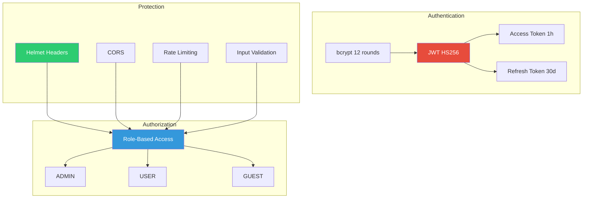

### Security Summary

| Feature | Implementation |
|---------|----------------|
| Authentication | JWT (HS256) with access/refresh tokens |
| Password | bcrypt with 12 salt rounds |
| Authorization | Role-based (ADMIN, USER, GUEST) |
| Validation | Zod schemas on all inputs |
| Headers | Helmet.js security headers |
| Rate Limiting | 100 req/hour global, 5/15min auth |
| CORS | Configurable allowed origins |

---

## Comparison: Node.js vs Python

```mermaid
graph LR
    subgraph "Node.js Implementation"
        N_RT[Node.js 22+]
        N_FW[Express.js 5.x]
        N_ORM[Prisma 6.x]
        N_VAL[Zod]
        N_GRPC[@grpc/grpc-js]
    end

    subgraph "Python Implementation"
        P_RT[Python 3.14]
        P_FW[Flask 3.1.2]
        P_ORM[SQLAlchemy 2.0]
        P_VAL[Marshmallow]
        P_GRPC[grpcio]
    end

    N_RT -.->|comparable| P_RT
    N_FW -.->|comparable| P_FW
    N_ORM -.->|comparable| P_ORM

    style N_RT fill:#339933,color:#fff
    style P_RT fill:#3776AB,color:#fff
```

| Feature | Node.js | Python |
|---------|---------|--------|
| **Runtime** | Node.js 22+ | Python 3.14 |
| **Framework** | Express.js 5.x | Flask 3.1.2 |
| **ORM** | Prisma 6.x | SQLAlchemy 2.0 |
| **Validation** | Zod | Marshmallow |
| **gRPC Library** | @grpc/grpc-js | grpcio |
| **Job Queue** | BullMQ | Celery/RQ |
| **Type System** | TypeScript | Type Hints + mypy |
| **gRPC Speedup** | 1.80x avg | 2.78x avg |

---

## Recommendations

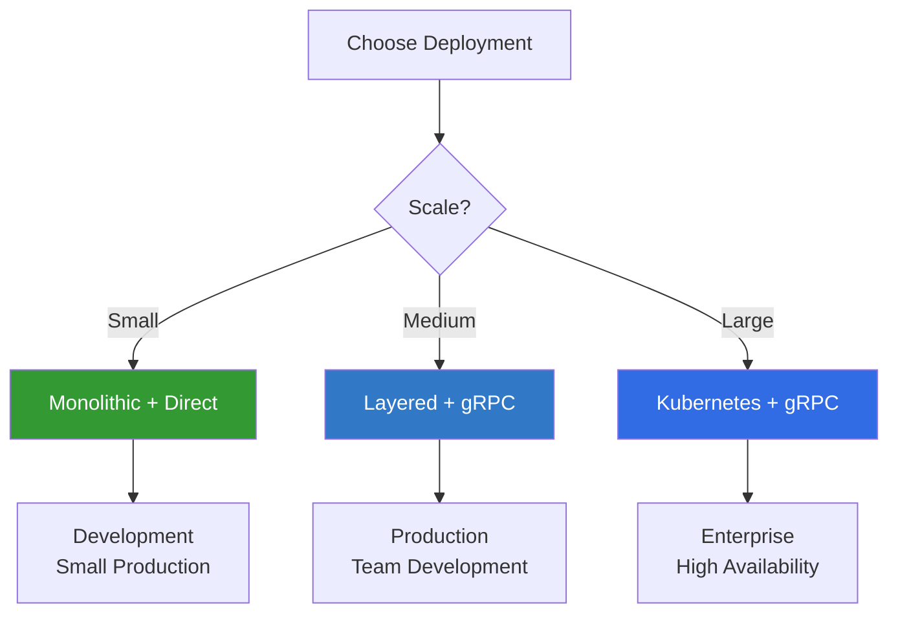

| Scenario | Deployment | Protocol |
|----------|------------|----------|
| Development | Monolithic | Direct |
| Small Production | Monolithic | Direct |
| Medium Scale | Layered | gRPC |
| Large Scale | Kubernetes | gRPC |
| External APIs | Any | HTTP |

---

## License

MIT License - See [LICENSE](LICENSE) for details.

---

## Contributing

1. Fork the repository
2. Create feature branch (`git checkout -b feature/amazing`)
3. Commit changes (`git commit -m 'Add amazing feature'`)
4. Push branch (`git push origin feature/amazing`)
5. Open Pull Request

---

**Status**: Production-ready with comprehensive test coverage, documented APIs, and enterprise-grade security controls.
